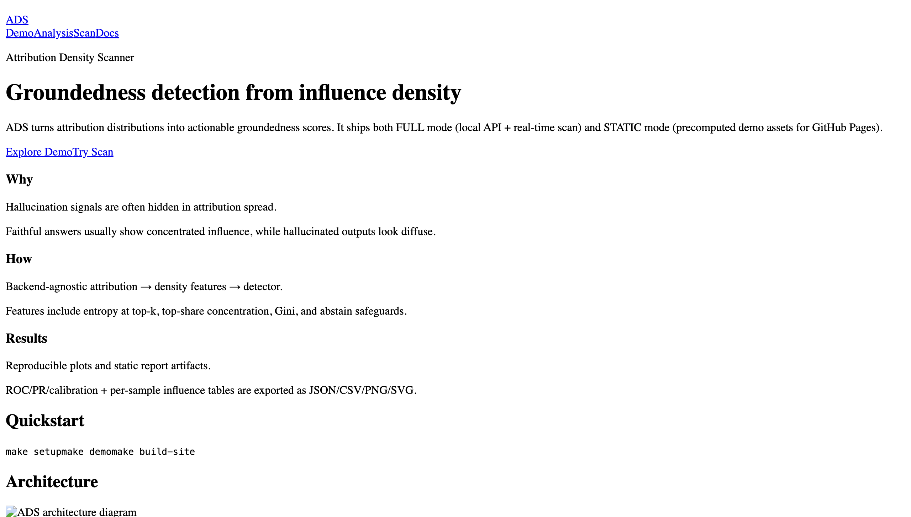
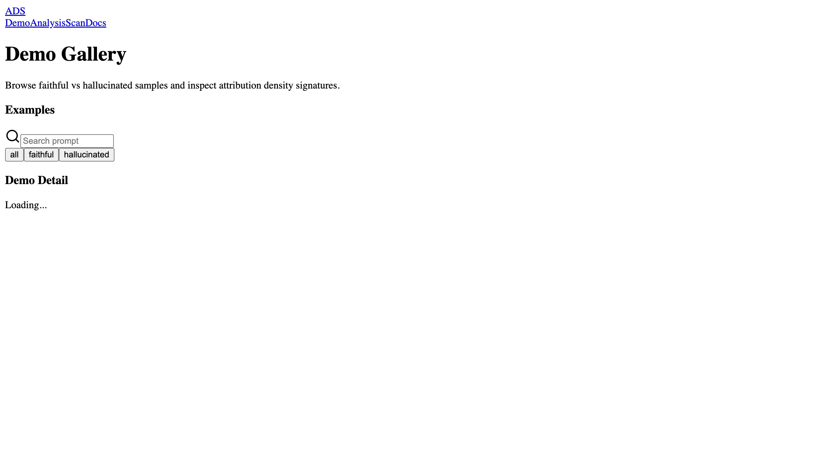
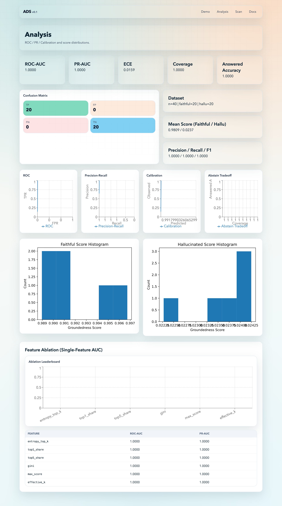
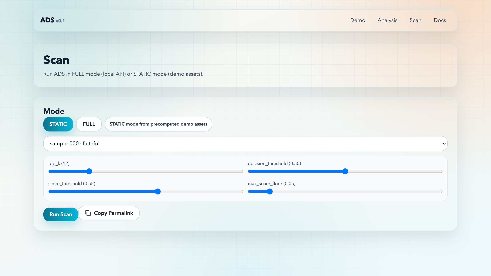

# Attribution Density Scanner (ADS)

[](https://github.com/shijiean/detector/actions/workflows/ci.yml)
[](https://github.com/shijiean/detector/actions/workflows/pages.yml)
[](LICENSE)

Attribution Density Scanner (ADS) 是一个作品集级 groundedness detector：
它不直接看文本表面特征，而是看 **训练数据归因分布密度**（attribution density），判断回答更像“有依据（faithful）”还是“幻觉（hallucinated）”。

项目提供两种运行模式：
- `FULL`：本地 Python 后端（CLI / FastAPI）实时 scan。
- `STATIC`：预计算 demo 资产，前端纯静态加载，兼容 GitHub Pages。

## 1 分钟上手

```bash
make setup
make demo
make build-site
```

完成后：
- 评估与模型产物在 `artifacts/`
- 前端静态资源在 `site/public/demo/`
- 站点导出在 `site/out/`
- 运行元数据清单在 `artifacts/run_manifest.json`

## 架构图


## 截图






## 方法概览

1. Attribution backend 输出 top-k 影响样本（默认 `toy_backend`，可复现且 CI 可跑）。
2. 提取 density 特征：`H@K entropy`、`top1/top5 share`、`gini`、`max_score`、`effective_k`。
3. Detector：
   - `threshold` 规则模型（无训练可用）
   - `logistic` 学习模型（`sklearn LogisticRegression` + 标准化）
4. Eval：`ROC-AUC`、`PR-AUC`、`Brier`、`ECE`、abstain coverage/accuracy，并输出图表。
5. Analysis：包含 `Coverage vs Accuracy` abstain 曲线 + 单特征 ablation 排行。
5. Analysis 扩展：自动导出单特征 ablation（one-feature logistic AUC）用于可解释性对比。

## 目录结构

```text
repo/
  ads/
  scripts/
  site/
  tests/
  .github/workflows/
```

按题目要求完整落地了 `ads/*`、`scripts/*`、`site/app/*` 与 CI/CD 配置。

## 常用命令

```bash
make setup        # 安装 Python + Node 依赖
make lint         # ruff/black/isort/mypy + next lint
make test         # 单元测试
make demo         # 生成可复现实验 artifacts + demo assets
make export-demo  # 仅导出演示资产到 site/public/demo
make build-site   # 构建 Next.js 静态站点
make serve-api    # 启动 FastAPI（FULL 模式）
```

### 一键端到端脚本

```bash
bash scripts/demo_end_to_end.sh
```

## FULL / STATIC 模式

### STATIC（默认）
- 前端直接读取 `site/public/demo/index.json` 与 `site/public/demo/examples/*.json`
- 可直接部署到 GitHub Pages

### FULL
1. 启动 API：`make serve-api`
2. 前端环境变量：`NEXT_PUBLIC_API_BASE=http://127.0.0.1:8000`
3. 访问 `/scan`，输入 prompt / answer 实时调用 `/scan`
4. 可选：调用 `POST /runtime/cache/clear` 清理后端与模型缓存
5. `/scan` 支持 `top_k`、`decision_threshold`、`score_threshold`、`max_score_floor` 调参

## 可选 backend 插件

- `ads/attribution/trak_backend.py`
- `ads/attribution/cea_backend.py`
- `ads/attribution/dda_backend.py`（experimental）

这些后端为可选适配器，不会阻塞 `make demo`。
依赖不可用时会给出清晰提示。

## 可复现性

- 固定随机种子（默认 `42`）
- 记录 split/config 到 `artifacts/data/`
- 统一产物输出：JSON/CSV/PNG/SVG

## CI/CD

- `ci.yml`：PR / main 执行 lint + test
- `pages.yml`：main 分支自动构建 demo 资产、静态导出并部署 GitHub Pages

## 局限与 Future Work

- `distributed truth` 场景下，正确回答可能天然是 diffuse attribution，仍需更强建模。
- attribution 计算成本在真实大模型上较高，后续可做缓存与近似检索加速。
- `TRAK/CEA/DDA` 目前为 best-effort 适配器，后续可补真实端到端 benchmark。

## 引用

见 `CITATION.cff`。

## 许可证

MIT，见 `LICENSE`。
