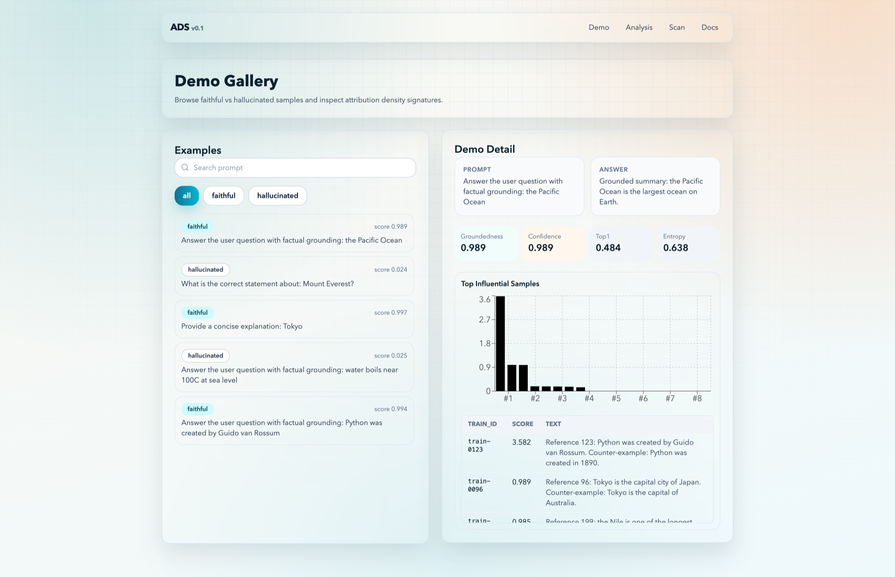
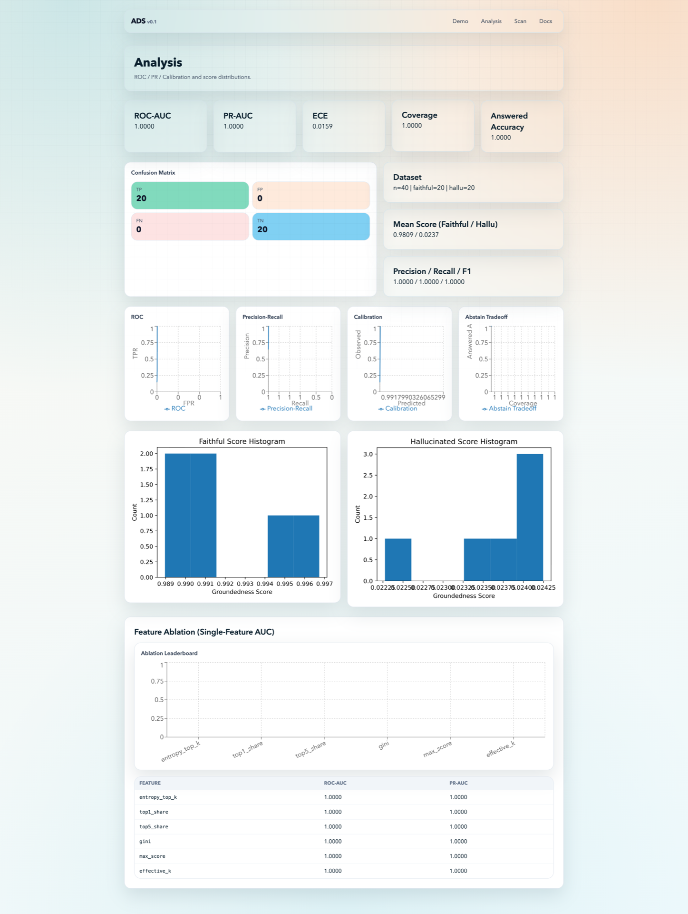
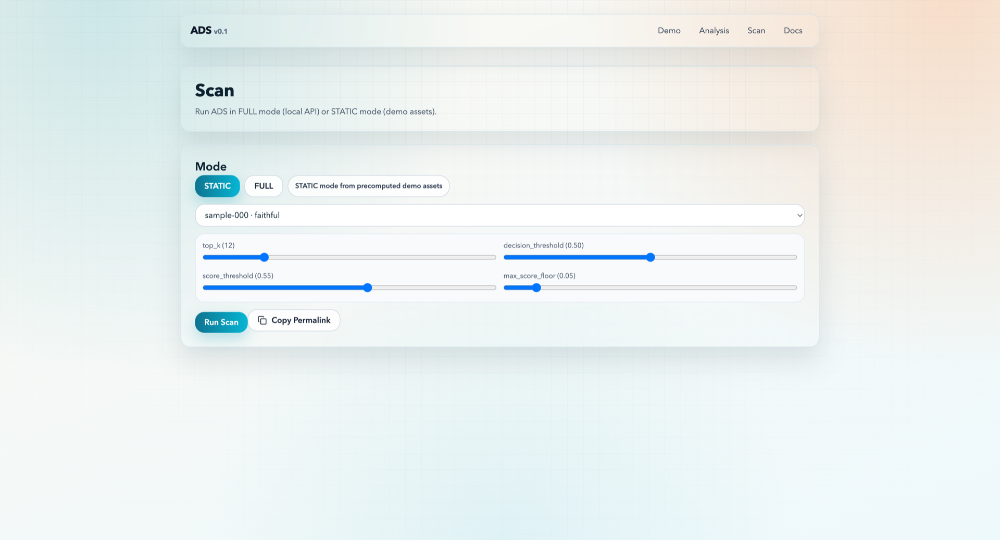

# Attribution Density Scanner (ADS)

[](https://github.com/Constantine-S-AN/detector/actions/workflows/ci.yml)
[](https://github.com/Constantine-S-AN/detector/actions/workflows/pages.yml)
[](LICENSE)

Attribution Density Scanner (ADS) 是一个 groundedness detector：
它通过训练样本归因分布密度（attribution density）来判断回答更接近 `faithful` 还是 `hallucinated`。

项目支持两种模式：
- `FULL`：本地 Python 后端（CLI / FastAPI）实时扫描。
- `STATIC`：预计算 demo 资产，前端纯静态加载（GitHub Pages 友好）。

## 1 分钟上手

```bash
make setup
make demo
make build-site
```

产物位置：
- `artifacts/`：数据、模型、指标、图表
- `site/public/demo/`：前端静态 demo 数据
- `site/out/`：Next.js 静态导出
- `artifacts/run_manifest.json`：本次运行元数据清单

## 架构图


## 截图






## 方法概览

1. Attribution backend 计算 top-k 影响样本（默认 `toy_backend`）。
2. 提取密度特征：`H@K entropy`、`top1/top5 share`、`gini`、`max_score`、`effective_k`。
3. Detector：
   - `threshold`（规则）
   - `logistic`（`sklearn LogisticRegression` + 标准化）
4. Eval 指标：`ROC-AUC`、`PR-AUC`、`Brier`、`ECE`、coverage、answered accuracy。
5. Analysis 面板：
   - ROC / PR / Calibration / Abstain Tradeoff
   - Feature ablation（单特征 AUC）
   - Confusion matrix + summary（TP/TN/FP/FN、均值分布）

## 目录结构

```text
repo/
  ads/
  scripts/
  site/
  tests/
  .github/workflows/
```

## 常用命令

```bash
make setup        # 安装 Python + Node 依赖
make format       # black/isort + prettier
make lint         # ruff/black/isort/mypy + next lint
make test         # pytest
make demo         # 生成完整 artifacts + demo assets
make export-demo  # 仅导出前端 demo 数据
make build-site   # 构建静态站点
make serve-api    # 启动 FastAPI（FULL 模式）
```

## 端到端脚本

```bash
bash scripts/demo_end_to_end.sh
```

流水线步骤：
1. `build_controlled_dataset.py`
2. `run_attribution.py`
3. `build_features.py`
4. `train_detector.py`
5. `evaluate_detector.py`
6. `export_demo_assets.py`
7. `write_run_manifest.py`

## Scan 页面功能

- FULL / STATIC 模式切换
- 阈值调参：`top_k`、`decision_threshold`、`score_threshold`、`max_score_floor`
- URL 参数双向同步（可分享实验配置链接）
- `Copy Permalink` 一键复制当前实验链接

## FULL / STATIC 运行

### STATIC
- 前端读取 `site/public/demo/index.json` 和 `site/public/demo/examples/*.json`
- 无后端依赖，可直接部署 GitHub Pages

### FULL
1. 启动 API：
   ```bash
   make serve-api
   ```
2. 设置前端环境变量：
   ```bash
   NEXT_PUBLIC_API_BASE=http://127.0.0.1:8000
   ```
3. 打开 `/scan` 进行实时扫描
4. 可选清缓存：
   - `POST /runtime/cache/clear`

## API 示例

```bash
curl -X POST http://127.0.0.1:8000/scan \
  -H 'Content-Type: application/json' \
  -d '{
    "prompt": "Provide one grounded fact about Tokyo",
    "answer": "According to the provided sources, Tokyo is the capital city of Japan.",
    "method": "logistic",
    "backend": "toy",
    "top_k": 20,
    "decision_threshold": 0.50,
    "score_threshold": 0.55,
    "max_score_floor": 0.05
  }'
```

## 可选 backend 插件

- `ads/attribution/trak_backend.py`
- `ads/attribution/cea_backend.py`
- `ads/attribution/dda_backend.py`（experimental）

这些后端是可选适配器，不阻塞 `make demo`。

## 可复现性说明

- 固定随机种子（默认 `42`）
- 中间结果固化：`scores.jsonl`、`features.csv`、`predictions_*.csv`
- 图表与资产固化：PNG/SVG + 前端 JSON
- `run_manifest.json` 记录运行时关键元数据与命令链

## CI/CD

- `.github/workflows/ci.yml`：PR / main 执行 lint + test
- `.github/workflows/pages.yml`：main 自动构建并部署 Pages

## 局限与 Future Work

- distributed-truth 场景下正确回答可能表现为 diffuse attribution
- 真实大模型归因成本较高，仍需缓存与近似检索优化
- `TRAK/CEA/DDA` 当前为 best-effort 适配器，后续可补真实 benchmark

## 引用

见 `CITATION.cff`。

## 许可证

MIT，见 `LICENSE`。
