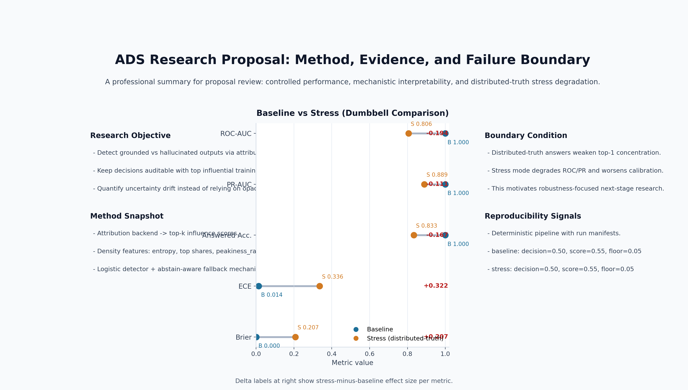
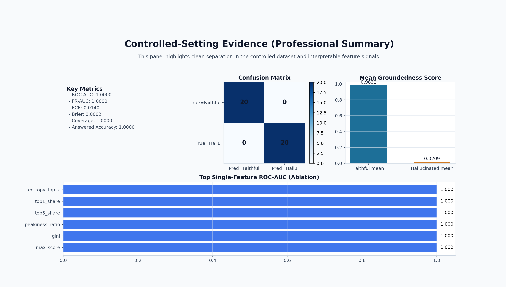
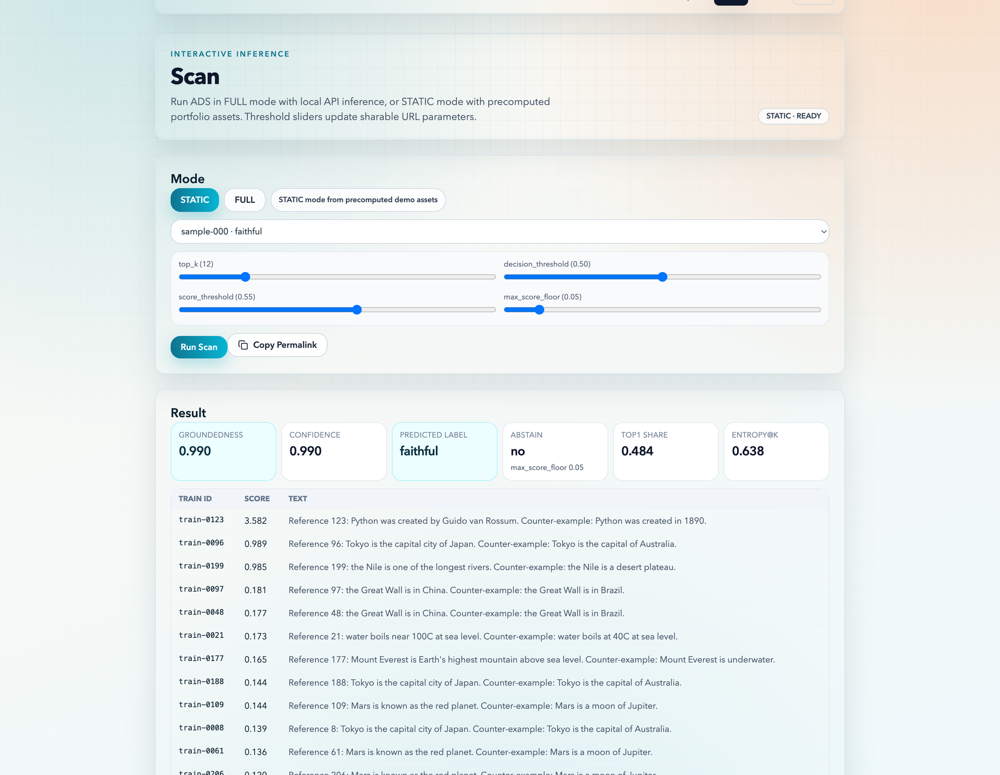
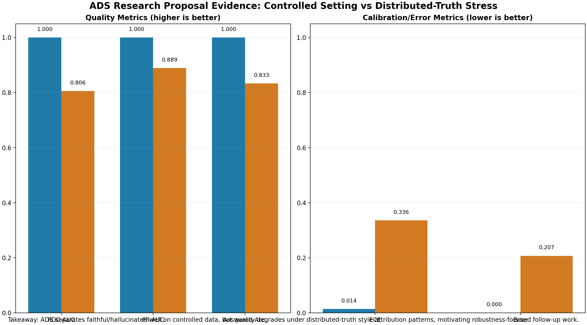

# Attribution Density Scanner (ADS)

[](https://github.com/Constantine-S-AN/detector/actions/workflows/ci.yml)
[](https://github.com/Constantine-S-AN/detector/actions/workflows/pages.yml)
[](LICENSE)

ADS 是一个 groundedness detector（可解释性导向）：
它利用训练数据归因分布密度（attribution density）区分 `faithful` 与 `hallucinated` 输出。

## Why ADS

- 用“影响力分布几何”替代单一置信度，减少黑盒判定。
- 提供 FULL（本地 API）与 STATIC（纯静态 Pages）双模式。
- 端到端可复现：固定随机种子、固化 artifacts、导出可视化与报告。

## 1-Minute Quickstart

```bash
make setup
make demo
make build-site
```

输出目录：

- `artifacts/`：数据、模型、指标、图表、报告
- `site/public/demo/`：前端静态 demo 资产
- `site/out/`：Next.js 静态导出产物
- `artifacts/run_manifest.json`：运行元数据清单

## Architecture


Pipeline:

1. Attribution backend（toy / trak / cea / dda）
2. Density features（entropy/top-share/gini/effective_k）
3. Detector（threshold + logistic）
4. Evaluation & plots（ROC/PR/Calibration/abstain/hist）
5. Static export for portfolio and GitHub Pages

Attribution 输出采用统一 JSONL schema（`scripts/run_attribution.py`）：

- `sample_id`, `backend`, `k_requested`, `k_effective`
- `items`: list of `{train_id, score, rank, text, source, meta}`
- `backend_meta`: backend 参数与说明（例如 score 语义）

Score 语义固定：**score 越大表示训练样本对当前输出越 influential**，`items` 按 `score` 降序排列。

## Density features definitions

- **H@K (top-K influence entropy)**
  - 先对 influence scores 降序排序并截断到 top-K。
  - 默认 `weight_mode="shifted"`：`s'_i = (s_i - min(topK)) + eps`，再归一化 `p_i = s'_i / Σ s'_j`。
  - 计算 `H@K = -Σ_i p_i log p_i`（自然对数）。
  - 默认主指标使用归一化版本：`H@K_norm = H@K / log(k_effective)`（`k_effective=min(K,n)`）。

- **Peakiness ratios（双版本）**
  - `peakiness_ratio_score = top1_score / sum_top5_score`（主结果默认使用该版本，也保持 `peakiness_ratio` 向后兼容别名）。
  - `peakiness_ratio_prob = p1 / sum_top5_p`（其中 `p` 使用 softmax(topK scores) 生成，用作对照）。

- **Defaults**
  - 默认 `K=20`（可通过 `scripts/build_features.py --h-k` 调整，支持逗号分隔多 K）。
  - 默认 `weight_mode="shifted"`，`eps=1e-12`。

## Proposal-Focused Demo Visuals



上图用于“提案首页”：把研究问题、方法链路、可复现性信号与压力测试退化证据放在同一张专业化视觉里。

1. Controlled setting（方法在可控数据上的效果证据）



2. Mechanism evidence（单样本可解释性：归因峰值 + top influential 证据链）



3. Boundary condition（research proposal 的核心动机：distributed-truth 下性能退化）



复现以上图像（含 overview）：

```bash
make demo
make demo-stress
python scripts/generate_proposal_figure.py
```

## Benchmark Snapshot (Toy Controlled Set)

- Dataset: `n=40` (`20 faithful / 20 hallucinated`)
- ROC-AUC: `1.0000`
- PR-AUC: `1.0000`
- ECE: `0.0159`
- Brier: `0.000319`
- Coverage: `1.0000`
- Answered Accuracy: `1.0000`

指标来源：`artifacts/metrics.json`（每次 `make demo` 后刷新）。

## Modes

### STATIC (GitHub Pages ready)

- 前端读取 `site/public/demo/index.json` 与 `site/public/demo/examples/*.json`
- 不依赖后端，可直接部署到 Pages

### FULL (Local API)

1. 启动 API
   ```bash
   make serve-api
   ```
2. 配置前端 API 地址
   ```bash
   NEXT_PUBLIC_API_BASE=http://127.0.0.1:8000
   ```
3. 打开 `/scan` 使用实时扫描

## Common Commands

```bash
make setup        # install python/node dependencies
make format       # black/isort + prettier
make lint         # ruff/black/isort/mypy + next lint
make test         # pytest
make demo         # end-to-end pipeline + static demo assets
make demo-stress  # distributed-truth stress pipeline (toy distributed mode)
make export-demo  # export only frontend demo assets
make build-site   # next static build
make serve-api    # run FastAPI for FULL mode
```

Multi-seed / backend-K ablation sweep（PR4a）：

```bash
python scripts/run_experiments.py \
  --backends dda_tfidf_proxy,toy,dda_real \
  --ks 5,10,20 \
  --seeds 0,1,2,3,4 \
  --detectors logistic
```

输出目录：`runs/<run_id>/`，其中包含每次运行产物、`summary.csv`（mean/std 聚合）与 `summary.md`。

## Development & Testing

- 依赖管理使用 `pyproject.toml`（PEP 621）+ optional extras。
- 安装开发/测试依赖：

```bash
pip install -e .[dev]
```

- 运行全量测试：

```bash
PYTHONPATH=. pytest -q
```

说明：API 测试依赖 `httpx`（已包含在 `[project.optional-dependencies].dev`），若环境缺失会在 `tests/test_api.py` 自动 skip。

## End-to-End Script

```bash
bash scripts/demo_end_to_end.sh
```

默认执行顺序：

1. `build_controlled_dataset.py`
2. `run_attribution.py`
3. `build_features.py`
4. `train_detector.py`
5. `evaluate_detector.py`
6. `export_demo_assets.py`
7. `write_run_manifest.py`
8. `ads.report.build_report`

## API Example

```bash
curl -X POST http://127.0.0.1:8000/scan \
  -H 'Content-Type: application/json' \
  -d '{
    "prompt": "Provide one grounded fact about Tokyo",
    "answer": "According to the provided sources, Tokyo is the capital city of Japan.",
    "method": "logistic",
    "backend": "toy",
    "allow_fallback": false,
    "top_k": 20,
    "decision_threshold": 0.50,
    "score_threshold": 0.55,
    "max_score_floor": 0.05
  }'
```

`/scan` 默认是 strict 模式（`allow_fallback=false`）：当请求 `logistic` 且模型缺失时返回 `400`（`code=MODEL_MISSING`），不会 silent fallback。若需要 API best-effort 行为，可显式传 `allow_fallback=true`。

## Optional Backends

- `ads/attribution/trak_backend.py`
- `ads/attribution/cea_backend.py`
- `ads/attribution/dda_backend.py` (experimental)

这些插件是 best-effort 适配，不阻塞 `make demo`。

> Note: `toy` backend 仅用于 sanity check / CI 演示，不应作为研究结论依据。
> toy 分布形态由 `attribution_mode`（数据字段/请求参数）驱动，而不是答案文本措辞。

## DDA backend quickstart (MVP)

### 1) 准备候选训练集合（small-corpus）

`DDABackend` 当前读取 JSONL 训练候选池（默认 `artifacts/data/train_corpus.jsonl`），每条至少包含：

```json
{"train_id": "train-0001", "text": "training snippet", "source": "optional"}
```

你可以直接复用：

```bash
python scripts/build_controlled_dataset.py --seed 42 --num-samples 40 --train-size 240
```

### 2) 一条命令跑通 DDA 小规模闭环

```bash
ATTR_BACKEND=dda DDA_ALPHA=0.35 DDA_CACHE_DIR=.cache/ads/dda bash scripts/demo_end_to_end.sh
```

### 3) 单独跑 attribution（含 cache 参数）

```bash
python scripts/run_attribution.py \
  --backend dda \
  --dataset-path artifacts/data/demo_samples.jsonl \
  --train-corpus-path artifacts/data/train_corpus.jsonl \
  --output-path artifacts/scores.jsonl \
  --top-k 20 \
  --dda-alpha 0.35 \
  --dda-min-score 0.0 \
  --dda-cache-dir .cache/ads/dda \
  --dda-model-id dda_tfidf_v1
```

### DDA cache 说明

- 默认目录：`.cache/ads/dda/`
- cache key 由以下稳定字段哈希得到：
  - `model_id`
  - `train_corpus_hash`
  - `sample_hash(prompt, answer, sample_id)`
  - `k`
  - `params(alpha, min_score)`

## DDA (TF-IDF proxy)

- backend 名称：`dda_tfidf_proxy`（旧的 `dda` 仍可用，但会触发 deprecation warning）。
- 用途：快速 sanity / CI，**不是** Wu et al. DDA 的完整复现。
- score 方向：越大越 influential，输出按降序排序。

示例：

```bash
python scripts/run_attribution.py \
  --backend dda_tfidf_proxy \
  --dataset-path artifacts/data/demo_samples.jsonl \
  --train-corpus-path artifacts/data/train_corpus.jsonl \
  --top-k 20 \
  --dda-alpha 0.35 \
  --dda-cache-dir .cache/ads/dda_tfidf_proxy
```

## DDA (real reproduction)

- backend 名称：`dda_real`
- 依赖：

```bash
pip install -e .[dda]
```

- 若未安装依赖，backend 会给出清晰报错并提示安装 `.[dda]`。
- 支持参数：`--dda-model-id`, `--dda-ckpt`, `--dda-device`, `--dda-cache-dir`, `--top-k`。

从 0 跑通示例：

```bash
pip install -e .[dev,dda]
python scripts/build_controlled_dataset.py --seed 42 --num-samples 40 --train-size 240
python scripts/run_attribution.py \
  --backend dda_real \
  --dataset-path artifacts/data/demo_samples.jsonl \
  --train-corpus-path artifacts/data/train_corpus.jsonl \
  --output-path artifacts/scores.jsonl \
  --top-k 20 \
  --dda-model-id sentence-transformers/all-MiniLM-L6-v2 \
  --dda-device cpu \
  --dda-cache-dir .cache/ads/dda_real
python scripts/build_features.py --h-k 5,10,20 --h-weight-mode shifted
python scripts/train_detector.py
python scripts/evaluate_detector.py
```

一条命令闭环（环境支持时）：

```bash
ATTR_BACKEND=dda_real DDA_DEVICE=cpu bash scripts/demo_end_to_end.sh
```

## Evaluation: bootstrap CI + calibration + stress analysis (PR4b)

`scripts/evaluate_detector.py` 支持：

- Bootstrap 95% CI：`roc_auc_ci`, `pr_auc_ci`, `ece_ci`, `brier_ci`
- Calibration 对照：`--calibration none|platt|isotonic`
  - 输出 pre/post ECE/Brier 和 calibration curve 点列
- distributed-truth 子集分析：`metrics.json` 中 `stress_analysis`
  - normal vs distributed_truth 的 precision/recall/FPR breakdown
  - 额外生成 `summary.md`，包含误报来源解释

示例：

```bash
python scripts/evaluate_detector.py \
  --features-path artifacts/features.csv \
  --model-path artifacts/models/logistic.joblib \
  --split-path artifacts/data/splits.json \
  --metrics-path artifacts/metrics.json \
  --plot-dir artifacts/plots \
  --calibration isotonic \
  --ci-bootstrap-n 1000 \
  --ci-seed 0 \
  --summary-md-path artifacts/summary.md
```

## Reproducibility Notes

- 固定随机种子（默认 `42`）
- 固化中间结果：`scores.jsonl`, `features.csv`, `predictions_*.csv`
- 固化图表与资产：PNG/SVG + 前端 JSON
- `run_manifest.json` 记录关键配置、指标快照与命令链

## CI/CD

- `.github/workflows/ci.yml`: PR/main 的 lint + test
- `.github/workflows/pages.yml`: main 自动构建并部署 Pages

## Limitations & Future Work

- distributed-truth 场景下，正确回答可能呈现 diffuse attribution
- 真实 LLM attribution 成本高，后续需缓存与近似检索优化
- `TRAK/CEA/DDA` 目前是接口级适配，后续补 benchmark 与实测报告
- Stress demo（toy distributed 模式）可复现实验边界：
  ```bash
  make demo-stress
  ```
  产物位于 `artifacts_stress/` 与 `site/public/demo-stress/`。预期现象是 `top1_share/peakiness_ratio` 下降，`ROC-AUC/PR-AUC` 变差，且 false positive 风险上升。

## Citation

See `CITATION.cff`.

## License

MIT (`LICENSE`).
