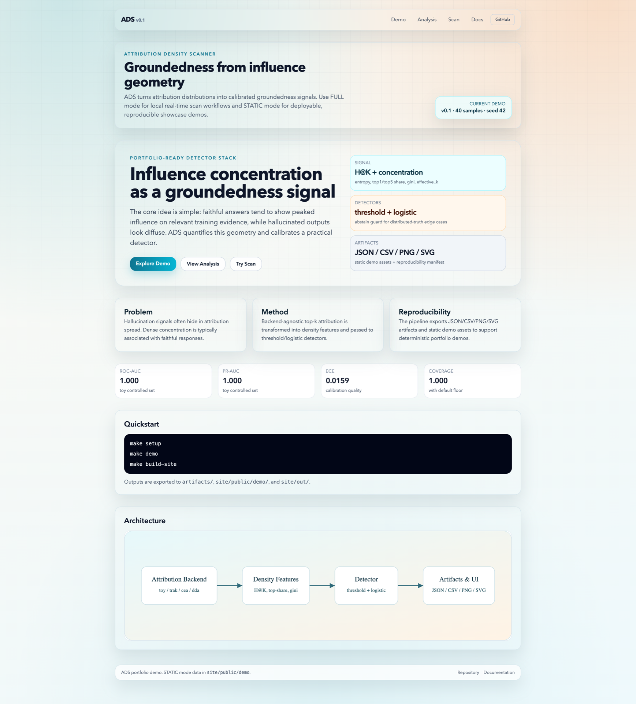
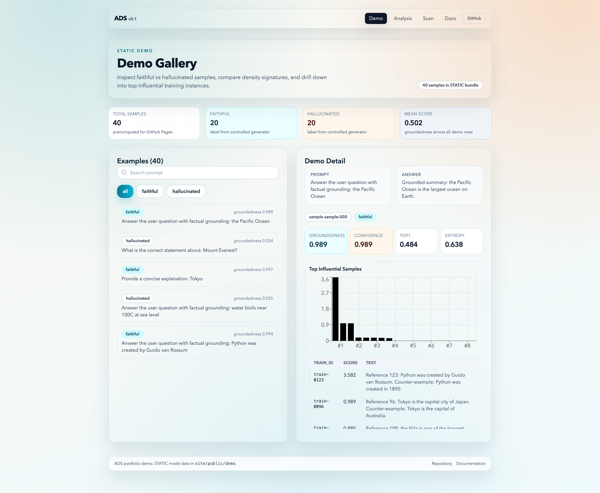
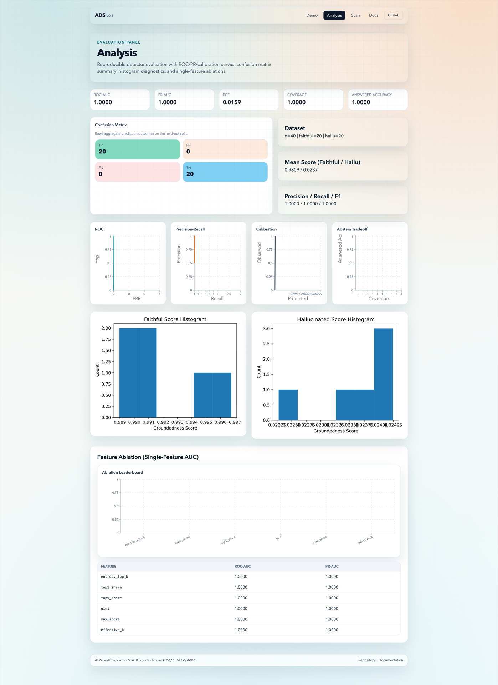
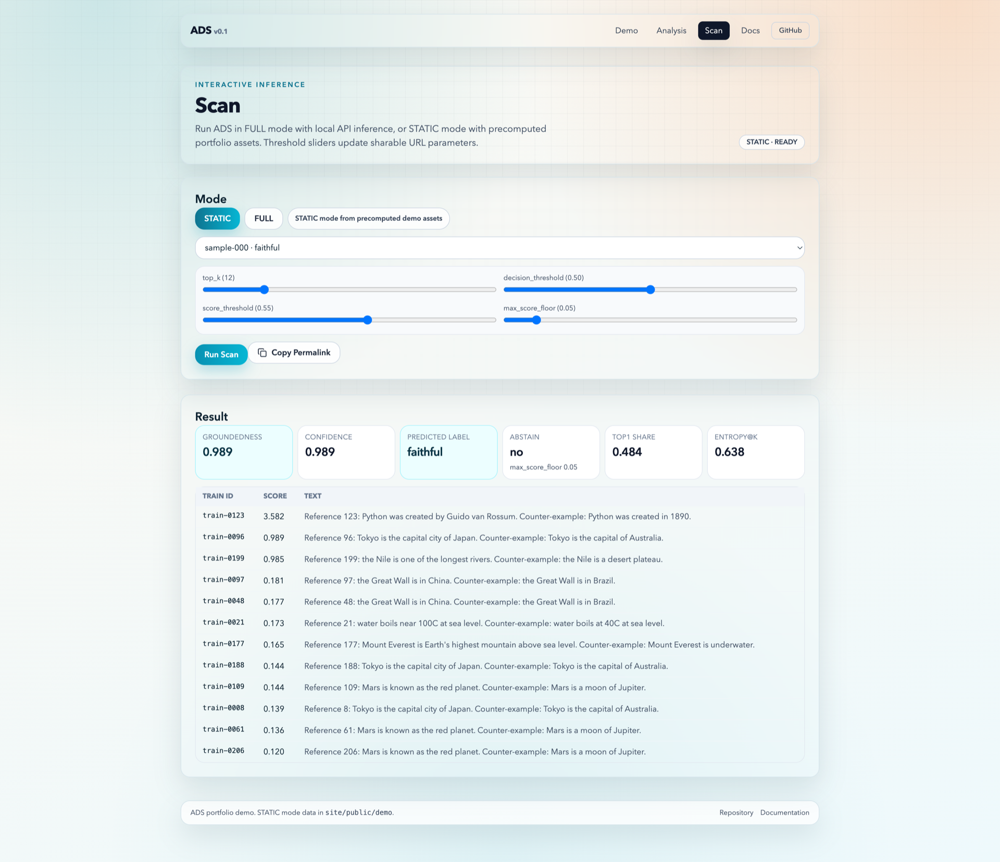

# Attribution Density Scanner (ADS)

[](https://github.com/Constantine-S-AN/detector/actions/workflows/ci.yml)
[](https://github.com/Constantine-S-AN/detector/actions/workflows/pages.yml)
[](LICENSE)

ADS 是一个 groundedness detector（可解释性导向）：
它利用训练数据归因分布密度（attribution density）区分 `faithful` 与 `hallucinated` 输出。

## Why ADS

- 用“影响力分布几何”替代单一置信度，减少黑盒判定。
- 提供 FULL（本地 API）与 STATIC（纯静态 Pages）双模式。
- 端到端可复现：固定随机种子、固化 artifacts、导出可视化与报告。

## 1-Minute Quickstart

```bash
make setup
make demo
make build-site
```

输出目录：

- `artifacts/`：数据、模型、指标、图表、报告
- `site/public/demo/`：前端静态 demo 资产
- `site/out/`：Next.js 静态导出产物
- `artifacts/run_manifest.json`：运行元数据清单

## Architecture


Pipeline:

1. Attribution backend（toy / trak / cea / dda）
2. Density features（entropy/top-share/gini/effective_k）
3. Detector（threshold + logistic）
4. Evaluation & plots（ROC/PR/Calibration/abstain/hist）
5. Static export for portfolio and GitHub Pages

## UI Screenshots






## Benchmark Snapshot (Toy Controlled Set)

- Dataset: `n=40` (`20 faithful / 20 hallucinated`)
- ROC-AUC: `1.0000`
- PR-AUC: `1.0000`
- ECE: `0.0159`
- Brier: `0.000319`
- Coverage: `1.0000`
- Answered Accuracy: `1.0000`

指标来源：`artifacts/metrics.json`（每次 `make demo` 后刷新）。

## Modes

### STATIC (GitHub Pages ready)

- 前端读取 `site/public/demo/index.json` 与 `site/public/demo/examples/*.json`
- 不依赖后端，可直接部署到 Pages

### FULL (Local API)

1. 启动 API
   ```bash
   make serve-api
   ```
2. 配置前端 API 地址
   ```bash
   NEXT_PUBLIC_API_BASE=http://127.0.0.1:8000
   ```
3. 打开 `/scan` 使用实时扫描

## Common Commands

```bash
make setup        # install python/node dependencies
make format       # black/isort + prettier
make lint         # ruff/black/isort/mypy + next lint
make test         # pytest
make demo         # end-to-end pipeline + static demo assets
make demo-stress  # distributed-truth stress pipeline (toy distributed mode)
make export-demo  # export only frontend demo assets
make build-site   # next static build
make serve-api    # run FastAPI for FULL mode
```

## End-to-End Script

```bash
bash scripts/demo_end_to_end.sh
```

默认执行顺序：

1. `build_controlled_dataset.py`
2. `run_attribution.py`
3. `build_features.py`
4. `train_detector.py`
5. `evaluate_detector.py`
6. `export_demo_assets.py`
7. `write_run_manifest.py`
8. `ads.report.build_report`

## API Example

```bash
curl -X POST http://127.0.0.1:8000/scan \
  -H 'Content-Type: application/json' \
  -d '{
    "prompt": "Provide one grounded fact about Tokyo",
    "answer": "According to the provided sources, Tokyo is the capital city of Japan.",
    "method": "logistic",
    "backend": "toy",
    "top_k": 20,
    "decision_threshold": 0.50,
    "score_threshold": 0.55,
    "max_score_floor": 0.05
  }'
```

## Optional Backends

- `ads/attribution/trak_backend.py`
- `ads/attribution/cea_backend.py`
- `ads/attribution/dda_backend.py` (experimental)

这些插件是 best-effort 适配，不阻塞 `make demo`。

## Reproducibility Notes

- 固定随机种子（默认 `42`）
- 固化中间结果：`scores.jsonl`, `features.csv`, `predictions_*.csv`
- 固化图表与资产：PNG/SVG + 前端 JSON
- `run_manifest.json` 记录关键配置、指标快照与命令链

## CI/CD

- `.github/workflows/ci.yml`: PR/main 的 lint + test
- `.github/workflows/pages.yml`: main 自动构建并部署 Pages

## Limitations & Future Work

- distributed-truth 场景下，正确回答可能呈现 diffuse attribution
- 真实 LLM attribution 成本高，后续需缓存与近似检索优化
- `TRAK/CEA/DDA` 目前是接口级适配，后续补 benchmark 与实测报告
- Stress demo（toy distributed 模式）可复现实验边界：
  ```bash
  make demo-stress
  ```
  产物位于 `artifacts_stress/` 与 `site/public/demo-stress/`。预期现象是 `top1_share/peakiness_ratio` 下降，`ROC-AUC/PR-AUC` 变差，且 false positive 风险上升。

## Citation

See `CITATION.cff`.

## License

MIT (`LICENSE`).
